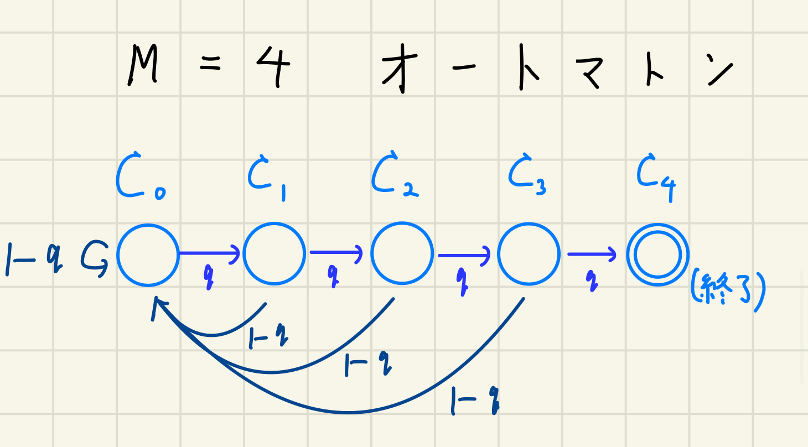

# 2023年度 大問3

## 問題

確率に関する母関数

$$
A_k(t)=\sum_{n=0}^{\infty}t^na_{kn}
$$

## 解答

### (1)

$M=1$の場合、四角い石が出た時点で操作は停止される。

よって、状態$C_0$から$n$個石を並べたときに初めて停止条件を満たす確率$a_{0n}$は、

$$\begin{aligned}
    a_{0n} =
    \begin{cases}
        0            & (n = 0   ) \\
        (1-q)^{n-1}q & (n \geq 1)
    \end{cases}\end{aligned}$$

となる。

よって、

$$
\begin{aligned}
    \mathbb{E}[L] & = \sum_{n=0}^{\infty} na_{0n}                   \\
                  & = \sum_{n=1}^{\infty} n(1-q)^{n-1}q             \\
                  & = q\frac{d}{dt}\left(\sum_{n=1}^{\infty}{t^n}\right)_{t=1-q} \\
                  & = q\frac{d}{dt}\left(\frac{1}{1-t}\right)_{t=1-q}            \\
                  & = q\frac{1}{\left(1-(1-q)\right)^2}                    \\
                  & = \frac{1}{q}                                   \\
\end{aligned}
$$

$$
\begin{aligned}
    \mathbb{V}[L] & = \mathbb{E}[L^2] - \mathbb{E}[L]^2                   \\
                  & = \sum_{n=0}^{\infty} n^2a_{0n} - \frac{1}{q^2}       \\
                  & = \sum_{n=1}^{\infty} n^2(1-q)^{n-1}q - \frac{1}{q^2} \\
                  & = \frac{2-q}{q^2}-\frac{1}{q^2}                       \\
                  & = \frac{1-q}{q^2}                                     \\
\end{aligned}
$$

となる。

(参考:これは幾何分布と呼ばれる分布である)

### (2)

まず、状態$C_k(k>M)$は定義されない事に注意する。(あるいは、定義されても$A_k(t)=0$)

また、状態$C_k(k=M)$の場合、既に操作は停止しているので、$a_{k0}=1$より、$A_k(t)=1$となる。

$k<M$の場合を考える。この時、状態遷移図は下図のようになる。



この図に示した通り、

- 確率$q$で四角い石が出る時、1個石を並べた上で、状態$C_{k+1}$に遷移する。

- 確率$1-q$で丸石が出る時、1個石を並べた上で、状態$C_0$に遷移する。

という関係性があるので、

$$
\begin{aligned}
    A_k(t)=qtA_{k+1}(t)+(1-q)tA_0(t) \quad (0 \leq k < M)
\end{aligned}
$$

となる。あるいは、同じことだが、

$$
\begin{aligned}
    A_{M-i}(t)=qtA_{M-i+1}(t)+(1-q)tA_0(t) \quad (0 < i \leq M)
\end{aligned}
$$

となる。

(なお、答えの書き方は色々あると思うが、恐らく上式のいずれかだけで十分だと思う。)

### (3)

(2)の結果より、

$$
\begin{aligned}
    A_{M-1}(t) & =qtA_{M}(t)+(1-q)tA_0(t)                                  \\
               & =qt+(1-q)tA_0(t)                                          \\
    A_{M-2}(t) & =qtA_{M-1}(t)+(1-q)tA_0(t)                                \\
               & =qt\left(qt+(1-q)tA_0(t)\right)+(1-q)tA_0(t)                     \\
               & =q^2t^2+(1-q)qt^2A_0(t)+(1-q)tA_0(t)                      \\
               & =q^2t^2+\left((1-q)qt^2+(1-q)t\right)A_0(t)                      \\
    A_{M-3}(t) & =qtA_{M-2}(t)+(1-q)tA_0(t)                                \\
               & =qt\left(q^2t^2+\left((1-q)qt^2+(1-q)t\right)A_0(t)\right)+(1-q)tA_0(t) \\
               & =q^3t^3+\left((1-q)q^2t^3+(1-q)qt^2+(1-q)t\right)A_0(t)          \\
\end{aligned}
$$

となっていく。

つまり、

$$
\begin{aligned}
    A_{M-i}(t) & =q^it^i+\left(\sum_{j=0}^{i-1}(1-q)q^{j}t^{j+1}\right)A_0(t)                \\
               & =(qt)^i+(1-q)t\left(\sum_{j=0}^{i-1}(qt)^{j}\right)A_0(t)                   \\
               & =(qt)^i+(1-q)t\left(\frac{1-(qt)^i}{1-qt}\right)A_0(t) \quad (0 < i \leq M)
\end{aligned}
$$

となる。

特に、$i=M$の場合を考えると、

$$
\begin{aligned}
    A_0(t)  = (qt)^M+(1-q)t\left(\frac{1-(qt)^M}{1-qt}\right)A_0(t) \\
\end{aligned}
$$

整理して、

$$\begin{aligned}
    A_0(t)     & =\frac{(qt)^M}{1-(1-q)t\left(\frac{1-(qt)^M}{1-qt}\right)} \\
    A_{M-i}(t) & =(qt)^i+(1-q)t\left(\frac{1-(qt)^i}{1-qt}\right)\frac{(qt)^M}{1-(1-q)t\left(\frac{1-(qt)^M}{1-qt}\right)} \quad (0 < i \leq M) \\
    A_{k}(t)   & =(qt)^{M-k}+(1-q)t\left(\frac{1-(qt)^{M-k}}{1-qt}\right)\frac{(qt)^M}{1-(1-q)t\left(\frac{1-(qt)^M}{1-qt}\right)} \quad (0 \leq k < M) \\
\end{aligned}
$$

となる。

(補足:
答えは合っている気がするけれど、整理しきれていない可能性は高い。式が汚すぎる。)

### (4)

(3)の結果より、

$$
\begin{aligned}
    A_0(t) & =\frac{(qt)^M}{1-(1-q)t\left(\frac{1-(qt)^M}{1-qt}\right)} \\
           & =\frac{(qt)^M(1-qt)}{(1-qt)-(1-q)t(1-(qt)^M)}       \\
\end{aligned}
$$

(1)と同様の考え方から、答えは$\left(\frac{d}{dt}A_0(t)\right)_{t=1}$である。

よって、これを微分して、代入整理すると、

$$
\begin{aligned}
    \frac{1-q^M}{(1-q)q^M}
\end{aligned}
$$

となる。

(なお、$M=1$を代入すると、これは$\frac{1}{q}$となり、(1)の結果に一致する)

## おまけ

コードによって、正当性を検証する。

[test.py](./test.py)

以下に、実験結果を示す。

``` {#code:実験結果 caption="実験結果" label="code:実験結果"}
M=1, q=0.1
avg=10.0076
(1 - q**M) / ((1 - q) * (q**M))=9.999999999999998
==========
M=1, q=0.2
avg=4.9994
(1 - q**M) / ((1 - q) * (q**M))=4.999999999999999
==========
M=1, q=0.3
avg=3.3353
(1 - q**M) / ((1 - q) * (q**M))=3.333333333333333
==========
M=1, q=0.4
avg=2.4801
(1 - q**M) / ((1 - q) * (q**M))=2.5
==========
M=1, q=0.5
avg=2.0025
(1 - q**M) / ((1 - q) * (q**M))=2.0
==========
M=2, q=0.1
avg=110.8138
(1 - q**M) / ((1 - q) * (q**M))=109.99999999999997
==========
M=2, q=0.2
avg=30.3796
(1 - q**M) / ((1 - q) * (q**M))=29.999999999999993
==========
M=2, q=0.3
avg=14.6192
(1 - q**M) / ((1 - q) * (q**M))=14.444444444444445
==========
M=2, q=0.4
avg=8.626
(1 - q**M) / ((1 - q) * (q**M))=8.749999999999998
==========
M=2, q=0.5
avg=5.9403
(1 - q**M) / ((1 - q) * (q**M))=6.0
==========
M=3, q=0.1
avg=1106.5573
(1 - q**M) / ((1 - q) * (q**M))=1109.9999999999998
==========
M=3, q=0.2
avg=153.216
(1 - q**M) / ((1 - q) * (q**M))=154.99999999999994
==========
M=3, q=0.3
avg=50.901
(1 - q**M) / ((1 - q) * (q**M))=51.48148148148149
==========
M=3, q=0.4
avg=24.4842
(1 - q**M) / ((1 - q) * (q**M))=24.374999999999993
==========
M=3, q=0.5
avg=13.7934
(1 - q**M) / ((1 - q) * (q**M))=14.0
```

確かに、大まかに一致しているため、正しいと考えられる。

## 参考文献

数学の景色."幾何分布の期待値(平均)・分散・標準偏差とその導出証明".2021年9月13日.<https://mathlandscape.com/geometric-distrib-ev/>
